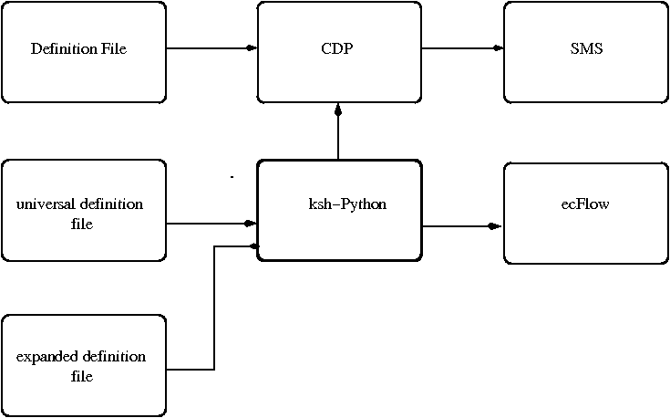

.. include:: <s5defs.txt>

=========================================
 ecFlow migration course - September 2011
=========================================

:Authors: John Hodkinson, Avi Bahra, Axel Bonet
:Date: September 15-16 2011

.. contents::
   :class: handout

.. _python: http://docs.python.org
.. _sms: http://www.ecmwf.int/publications/manuals/sms/course/index.html
.. _ecf: http://edit.ecmwf.int/publications/manuals/ecflow/course/index.html
.. |bullet| unicode:: U+02022
.. _ecfs: ecflow_server
.. _ecfc: ecflow_client
.. _ecfv: ecflowview
.. _home: $HOME
.. _ footer:: :tiny:`ecFlow - September 2011`

.. _ footer:: .. class:: bottom right 
.. _	    .. image:: ui/small_ecmwf/ECMWF_logo.png
.. _	      :height: 100

.. _ footer:: .. image:: ui/small_ecmwf/ECMWF_logo.png :height: 10

AIMS
============

* Information

* What is ecFlow ?

* Development environment

* Technology

* Similarities with SMS

* Differences

* Examples

* Migration

* Schedule

Information
===========

* Platforms: Linux, Linux Cluster, IBM, HPUX

* Files:

  * Client

  * Server

  * Python Extension

  * GUI (only available on Linux)

  * PATHS: /usr/local/apps/ecflow/<version>/bin

* User manual: /usr/local/apps/ecflow/<version>/doc

* Online Tutorial: http://intra.ecmwf.int/metapps/manuals/ecflow

What is ecFlow ?
================

.. class:: incremental

* Client/Server based replacement for SMS

* Complete re-write in C++, to improve maintenance and ease of development

* Similar scheduling and supervision functionality to SMS

* Python API can be used to generate definition structure

* Client Server API available on the command line and in Python

* Allows reuse of existing task wrapper/header files, with some modifications

* GUI similar to XCdp. To be rewritten in the future

.. _ jira http://software.ecmwf.int/issues/browse/ECFLOW-11

Development environment
========================

.. class:: incremental

* Eclipe CDT Indigo: http://www.eclipse.org/indigo

  * C++ Integrated Development Environment
  * Syntax highlighting
  * Customisable formatting
  * cross reference, navigation

* Perforce plug-in

  * Check-in, Checkout, Get latest revision
  * Revision history, compare

* Python plug-in

  * Auto-complete
  * Debug

Technology
===========

.. class:: incremental

* Current documentation using Sphinx Pocoo: http://sphinx.pocoo.org

  * Tutorial, Automated Python API, documentation

* Boost: http://boost.org
   
  * ASIO
  * Python
  * Program options
  * Spirit
  * Serialization
  * Test
  * Date-Time, File-system

* bjam 

Similarities with SMS
=======================

.. class:: incremental

* Functionality is very similar

  * Suites, Family, Task, Variables, Trigger, Time, Date, Late, etc
  * Child commands: init, complete, event, meter, label, wait, abort
  * Variable inheritance

* Scripts are similar

  * file name extension: .sms -> .ecf
  * SMS variables replaced with ECF, i.e. SMSHOME -> ECF_HOME
  * Preserve investment

* White list file
* GUI: is to be changed in the future

Differences with SMS (1)
========================

.. class:: incremental

* Maintenance and enhancement of Client/Server easier

  * Built from the ground up in C++
  * Design Patterns, Observer, Template, Singleton, etc
  * Test Driven, huge set of regression tests.

* SMS provides a custom scripting language, ecFlow provides Python integration, that allows:

  * Building of suite definition
  * Client-Server communication

* Not restricted to Python, can use text format and shell level interface

* Published text format
  
  * Simple format, Any language for generating the suite definition
  * No interpretation
  * No loops, conditionals, or functions

Differences with SMS (2)
========================

.. class:: incremental

* Improved Error Checking for:

  * Trigger Expressions
  * Validation of externs in Trigger expression
  * Earlier checking for job generation
  * checks for recursive includes
  * Simulation with out the need for scripts or server

* Customisable handling of zombies

* Storage of remote id allows zombies to be killed

* When a task is aborted, a reason can be provided

* No explicit login

* No autorestore, no automigrate

* log file

Text Format Example
===================

::

   suite suite
      edit ECF_INCLUDE /home/ma/ma0/course      # comment line
      task foo
         label foo ""
         date 01.*.*
      family familyName
         task a
            event 1 theEventName
         task b
         family heir_familyName
            task a
               meter myMeter 0 100
            task c
               trigger (a == complete and ../b == complete)
         endfamily
      endfamily
   endsuite
      

Examples
=========

* Correct by Construction
  
The Python API supports a correct by construction approach. 

For example adding nodes of the same name, at the same level, will throw a RuntimeError exception:: 

    import ecflow
    defs = ecflow.Defs()
    suite = defs.add_suite("s1")
    suite.add_task("t1")
    suite.add_task("t1") # exception thrown
    >>RuntimeError: Add Task failed: 
    >>  A task of name 't1' already exists 
    >>  on node SUITE:/s1

Examples
=========

* Correct by Construction

  Adding dependencies like dates are also checked::

    import ecflow
    defs = ecflow.Defs()
    suite = defs.add_suite("s1")
    task = suite.add_task("t1")
    # day, month, year, month is not valid
    task.add_date(1, 14, 2007) 
    >> IndexError: Invalid Date(day,month,year): 
       the month >= 0 and month <= 12, 
       where 0 means wild card

Examples
=============

* Checking

  Some checking has to be deferred until the definition is fully defined::

    import ecflow
    defs = ecflow.Defs()
    suite = defs.add_suite("s1")
    suite.add_task("t2")
    suite.add_task("t1").add_trigger("t2 == active)")
  
    assert len(defs.check()) != 0, \
    "Expected Error: miss-matched brackets in expression."

Examples
===============

* Job Checking

  Job creation is process of locating a '.ecf' script corresponding to a task and then generating a job file. This can be checked before a definition is loaded into the server::

  >>># Generate jobs for the *ALL* tasks in 
  >>># the definition given by variable 'defs' and 
  >>># print errors to standard out.
  >>>job_ctrl = JobCreationCtrl()
  >>>defs.check_job_creation( job_ctrl )
  >>>print job_ctrl.get_error_msg()

Examples
==========

* Client/Server: load definition into the server::
  
  >>>import ecflow
  >>>defs = ecflow.Defs(); # ...
  >>>try:
  >>>  ci = ecflow.Client("localhost:3141")  # create a client
  >>>  ci.restart_server()                   # restart if halted
  >>>  ci.load(defs)                         # play
  >>>  ci.begin_suite("s1")                  # begin
  >>>except RuntimeError, e:
  >>>  print "failed: " + str(e)

Trigger checking
=================

.. class:: incremental

* SMS does not complain when a trigger references a non-existant node

* ecFlow provides a command to check triggers with orphan references

* Job generation control for ecFlow. 

  SMS script equivalent is script-Edit-Preprocess-Execute

* CDP is permissive: no complaints, provided math tree can be built. 

  It may accept unbalanced bracket expression. 

Migration
==============

.. class:: incremental

* Validation by operations first. Once done and stable, open up to other departments and eventually the member states.

* The task scripts and header files can be re-used, with small changes

* A completely automated migration from CDP based definition file to ecflow based python scripts is not normally  possible. 

* Python is a fully object oriented language, so to take full advantage, CDP scripts should be completely rewritten.

Timeline
===========

* Online tutorial avalable for training

* Internal beta is in testing

* Full release is expected in 2012

Where we are now...
====================

.. class:: incremental

* Do we do a one off transition ?

* Or need to load the suite on both systems ?

  * include/task wrapper files on both systems ?

* Best case: only head.h and tail.h have system dependency

* embedded children call: IFS, MARS need system scripts (smslabel, smsevent, smsmeter). To intercept the call

  * identify the scheduler in charge, 
  * call the right child command

* administrative tasks demand attention: from cdp to python for batch remote control of the server (e.g. force complete, alter variable)

Components
==========

.. class:: incremental

* ecflow_server: a Supervisor, Monitoring, Scheduler, just not SMS

* ecflow_client: 

  * command line interface from a terminal

  * user commands
	
  * jobs supervision: child commands, status and attributes update

* client, batch mode: ecflow_client, python api

* ecflowview: graphical user interface

Server Functionality
====================

.. class:: incremental

* setup environment: use ecflow # /usr/local/apps/ecflow/current/bin

* startup:

  * ecflow_start.sh; ecflow_stop.sh
  * ecflow_server --port $((1500 + $(id -u)))	
  * nohup ecflow_server > ecf.out 2>&1 &

* hosts the suites

* checkpoints (backup) suites tree

* handles user and job requests

* logs activity

* white list access file, ECF_PASS, to detect-prevent unwanted requests

Server
======

* configuration:: 

	ECF_HOME,  # server admin directory
	ECF_PORT,  # port number $((1000 + $(id =u))) - 1500 
	ECF_CHECK, #  checkpoint file name
	ECF_CHECKOLD, # backup checkpoint file name
	ECF_LOG,   # server log file name
	ECF_CHECKINTERVAL, # [120], 600 sec
	ECF_LISTS, # white list file name
	ECF_DEBUG_SERVER

* server log file: ecflow_client --log=new # [new|clear|flush]

Text client interface
=====================

.. class:: incremental

* for remote assistance or batch mode 

* for monitoring and interaction::

	ecflow_client --get # --group="get; show state" 
	ecflow_client --get_state
	ecflow_client --alter change variable NPES 60 /emc

* implicit-explicit call::

	ECF_NODE, ECF_PORT (ECF_NAME, ECF_PASS)
	ecflow_client --port 3141 --host mordred --get

* load-replace suites into the server::

	ecflow_client --load mc.def
	ecflow_client --replace=/emc mc.def

.. _* accurate control for advanced commands: loop, one path at a time, multiple paths

Child commands: ecflow_client
=============================

.. class:: incremental

* self contained manual: ecflow_client --help

* status update: --init <PID-QID>, --abort <cause>, --complete

* attribute update: --event <name>, --meter <name> <value>, 

  --label <name> <text>

* embedded trigger: --wait <expression>

* when a job cannot connect (one host name per line):: 

	export ECF_HOSTFILE=$HOME/.ecf_hostfile 

* going further::

	ecflow_client --alter add    variable FCNPES 60 /emc
	ecflow_client --alter change variable THREADS 1 /emc

Child commands: ecflow_client
=============================

* configuration::

	ECF_NODE, # server hostname
	ECF_PORT, # server port
	ECF_NAME, # task path
	ECF_PASS, # pseurandom string to detect zombies
	ECF_TRYNO, # job occurence number
	ECF_HOSTFILE, # hostname list for alternative servers
	ECF_RID,  # job remote id (queuing id)
	ECF_TIMEOUT, # interval between two attempts 
	ECF_DENIED, # to enable job exit with error before 24h
	NO_ECF,   # standalone mode 
	ECF_DEBUG_CLIENT

Graphical client interface: ecflowview
======================================

.. class:: incremental

* Initial version based on Xcdp

* for broadband connection, for both monitoring and interaction

* most text commands, restricted 

* direct access to information: script, manual, job, output

* user can restrict available commands::
	
	Edit->Preferences->User-Operator-Administrator modes

* user can configure nodes/statuses/attributes display, vertical-horizontal display (node + ctrl-middle-mouse-button + close,open)
	

* $HOME/.ecflowrc: servers, X.options, ecflowview.menu

Client-Server environments
==========================

* CDP: command and display program (SMS)

* Korn Shell

* Python

Using CDP 
=====================

.. class:: incremental

* rc file environment setting: variables IOIRC, CDPRC, ./.ioirc, ./.cdprc, $HOME/.ioirc, $HOME/.cdprc

* variables, variables import, aliases, functions::

	set var value
	var=1           # math
	setenv -i USER HOST
	alias ok echo ok
	define my_function { 
          echo ok # $# $* shift return
        }

* history: !<cmd>, !!, !n
* no protected keyword, e.g. "task do" is accepted
* # comments
* variable rc for latest return code (TRUE=1, FALSE=0)

Using CDP
=====================

.. class:: incremental

* simple language:

  * if (<math>) then <cmds>; else <cmds>; endif

  * while (<math>) do <cmds>; endwhile

  * for var <math> <math> [step(<math>] do cmds; endfor

  * loop var (<spaced-list>) do <cmds>; endloop

  * case var 
    in (<spaced-list>) do <cmds>; endin; 
    in ( ) do <default>; endin; 
    endcase

  * math expressions may not contain $ for variables

* close connection with underlying shell:

  * $ shell-cmd
  * % c-shell-cmd 
  * set var \`shell-cmd\`

* include files: ``CDP> < inc_revervation.def``

* pipes, redirections: ``CDP> ls -NR /mc | grep > out``

* debug: "set debug on", open-source

* self contained documentation: man

Using the Korn shell
====================

.. class:: incremental

* environment setting: $HOME/.kshrc,  $HOME/.profile (once at login)

* variables, posix aliases, functions:: 

    var=value
    alias ok="echo ok"	
    function fct { 
      echo ok # $# $* shift return
    }
    fct() {
      echo ok
    }

* history: r (?), !cmd, !!, !n

* protected keywords, builtin keywords (time, limit), homonyms (date)
* # comments
* variable $? for latest return code (OK=0, ERR=1)

Using the Korn shell
====================

.. class:: incremental

* one-to-one control structure matching:

  * if (( <math> )) then <cmds>; 
    elif [[ <math> ]]; then <cmds>; 
    else <cmds>; 
    fi

  * while [[ <math> ]]; do <cmds>; done

  * while ((<math>)); do <cmds>; var=$((var+step)); done

  * for var in <spaced-list> do <cmds>; done

  * case $var in <piped-list>) <cmds>;; \*) <default>;; esac

* include files: ". inc_common.def"

* pipes, redirections: native

* debug: set -eux; PS4

* documentation: man (MANPATH), bash:help

Using Python
============

* environment setting: $HOME/.pythonrc, PYTHONPATH (modules location)

* variables, aliases(?), function (named arguments, default valued argument, documentation)

  >>> var=<value>; var="string"; var=True; var=False; var=None
  >>> def ok(): print "ok"        # alias
  >>> def fct(a="def", b=None): 
  >>>   """ documentation example """
  >>>	if b: print a, b
  >>> fct(a="a", b="b"); fct(b=1)

* classes http://docs.python.org/tutorial/classes.html

* errors handling: try, except, finally, raise,
  http://docs.python.org/tutorial/errors.html

* documentation: http://docs.python.org/library/functions.html, 

	>>> help()

Using Python
============

.. class:: incremental

* control structure matching:

  * while <math>: <cmds>
  * while <math>: <cmds>; var=var+step
  * for var in <list>: <cmds>
  * for var in xrange(0, n+1): <cmds>
  * if var in <list>: <cmds>; elif var=="value": <cmds>; else: <cmds>

* module import::

    >>>from mylib import *
    >>>from mylib import a, b, c
    >>>import another_lib
    >>>import long_name as short

* debug: python -m trace -t, pylint, pychecker, coverage

* beware indentation

Migration to ecFlow
====================

.. class:: incremental

* best case? starting a new project, a new suite

* one off translation: task wrappers, task headers, suite definitions

* or create a definition file loadable by both SMS and ecFlow

* installation: /usr/local/apps/sms/bin, /usr/local/apps/ecflow/current/bin

* startup: sms_start, sms -b, sms - ecflow_start.sh, ecflow_server

* SMS_PROG - ECF_PORT

* child commands: compilation and installation, for all remote platforms

* script: rename, copy, link, recode (ecf_submit, ecf_kill, ecf_status)

Migration: task wrappers
===================================

.. class:: incremental

* default file name extension (.ecf) or 

  part of suite definition (edit ECF_EXTN ".ecf")

* minimum changes requested ? move, copy, link (p4 history)

* simple when task is restricted to::

	 %include <head.h> ... %include <tail.h>

* beware smart server interacting tasks, watch dogs, monitoring tasks::

    cdp <<EOF
    setenv -i USER HOST; login $HOST $USER 1; 
    alter -V /path:VAR value;  force -r /path complete
    EOF
    ecflow_client --change variable "VAR" "value" /path
    ecflow_client --force complete recursive /path

Migration: task headers
==================================

.. class:: incremental

* translate variables names ? sed -f convert-min.sed <file>

* include additional header to work in both mode: %include <ecf.h>

* SMS_PROG, ecflow communication port, as discreminator::

	if [[ %SMS_PROG:0% != 0 ]]; then echo SMS_NODE
	elif [[ %ECF_PORT:0% != 0 ]]; then echo ECF_NODE; fi

* convert SMS system variables: 

    * provide default values: %SMSTRYNO:0%
    * translate: %ECF_TRYNO:0%
    * use shell variable: $ECF_TRYNO

Migration: expanded suite definition
======================================

.. class:: incremental

* both SMS and ecFlow can load an "expanded" definition file::

    autocancel
    clock  complete  cron     date    day   defstatus    
    edit   endfamily endsuite endtask event extern       
    family inlimit   label    late    limit meter        
    repeat suite     task     time    today trigger      

* removed keywords (``CDP> man -s play``)::

    EOF     abort    action    automigrate autorestore
    owner   text

Migration: suite definition
======================================

.. class:: incremental

* expand suite definition from SMS server::

      log="set SMS_PROG $SMS_PROG; login $HOST $USER 1"
      cdp -c "$log; get /$SUITE; show /$SUITE > out"

* expand suite definition from local file::

      cdp -c "play -l $SUITE.def; show /$SUITE > out"

* translate, apply sed filter (variables name, filter out)::

      sed -f sms2ecf-min.sed out > ecf.def

* load-reload a suite into ecFlow::
      
      log="--port $ECF_PORT --host $HOST"
      ecflow_client $log --load ecf.def 
      ecflow_client $log --replace /$SUITE ecf.def 

Migration: suite definition
======================================

Migration: suite definition - shell
==============================================

.. class:: incremental

* ksh as an environment to generate expanded suite definition

* beware: time, limit, date, keywords

* dedicated file descriptor::

	exec 5>x.def # open
	print -u5 "suite x"; 
        print -u5 "family y"; print -u5 "task z"
	# exec 5<&-  # close
	task() { 
	print -u5 "task $*"
	} 
	family() { 
	echo "family $*" >&5
	} 

Migration: CDP-Ksh vs Python
===============================================

.. class:: incremental

* CDP rc files: multilayer configuration files,

  * standalone environment: quit, restart to reset

* Korn shell: global scope for variables, aliases, functions

* Python: toward modules

  * class inheritance: suites template
  * strong types: if fam == "12" or fam == 12: pass
  * string manipulation::

     PROJECT = "emc"; file_name = "mc.def"
     ecf = "ecflow_client --replace"
     cmd = "%s /%s %s" % (ecf, PROJECT, file_name)
     os.system(cmd)

Migration: debugging
===============================================

.. class:: incremental

* CDP: set debug on, ddd, gdb

* Ksh:

  * ksh -n
  * set -e stop on first error
  * set -u no undefined variable
  * set -x print command before execution
  * PS4 variable: time stamping, runtime

* Python: 

  * Eclipse Pydev: step through the code
  * python -m trace -t script.py
  * pylint, pychecker
  * coverage run mc.py, coverage html mc.py  

Migration: suite definition - Python
===============================================

.. class:: incremental

* Python not for job scripting on HPC at ECMWF, so far!

* Python api to create a suite tree:
	>>> from ecflow import *
	>>> s = Suite(emc)
	>>> defs = Defs()

* print expanded file: >>> f = open("mc.def", "w"); print >> f, defs
* played into sms or loaded into ecFlow

* class definition, class derivation: main-lag-pop families, logtasks

* verbosity can be reduced: multiple arguments at once::

    import inc_hostc as ih
    def extern(*args):
      for path in args:
        ih.extern(expand(path))

Migration: suite definition - python
===============================================

.. class:: incremental

* trigger-complete expressions::

    from string import Template
    dl = { 'root': "/o", 'SELECTION': "/mc" }
    trigger("$root/main:YMD gt ${SELECTION}/main:YMD")

    root = "/o"; SELECTION = "/mc"
    path = "%s/main:YMD gt %s/main:YMD" % (root, SELECTION)
    trigger(path)		

* shell connection: shell variables import, shell command output::

      USER = os.getenv("USER")
      def shcmd(cmd):
        try:
          read, err = popen2.popen2(cmd)
          out = read.readlines()
          return str(' '.join(out).replace('\n', ''))
        except: 
          print "prb with the command ", cmd, err
          raise

Migration: using child commands
======================================

* parallel indepent mode:

  * PATH=/use/local/apps/sms/bin:$PATH
  * use ecflow
  * PATH=/use/local/apps/ecflow/current/bin:$PATH

.. image:: img11/svr_job_1.png
   :align: center
   :height: 400

Migration: using child commands
======================================

* using a filter:

  * PATH=/use/local/apps/sms/ecflow/bin:$PATH

.. image:: img11/svr_job_2.png
   :align: center
   :height: 400

From CDP Variables
==================

CDP variables can be used for multiple purposes:

* within a CDP session (control structures: if, case, loop, while, for)

* for one or multiple SMS variables definitions::

   set  HOST       c1a
   edit SCHOST     $HOST
   edit SMSLOGHOST $HOST

* imported variables: setenv -i

* to simplify trigger-complete expression

Migration: Migrated Variables
=============================

.. class:: small

=============== ================== =============== ===================
sms2ecf =       {                       
--------------- ------------------ --------------- -------------------
'SMSNAME' :     'ECF_NAME',        'SMSPID' :      'ECF_PID',
'SMSNODE' :     'ECF_NODE',        'SMSHOST' :     'ECF_HOST',
'SMSPASS' :     'ECF_PASS',        'SMSDATE' :     'ECF_DATE',
'SMS_PROG' :    'ECF_PORT',        'SMSURL' :      'ECF_URL',
'SMSINCLUDE' :  'ECF_INCLUDE',     'SMSURLBASE' :  'ECF_URLBASE',
'SMSFILES' :    'ECF_FILES',       'SMSCMD' :      'ECF_JOB_CMD',
'SMSTRYNO' :    'ECF_TRYNO',       'SMSKILL' :     'ECF_KILL_CMD',
'SMSTRIES' :    'ECF_TRIES',       'SMSSTATUSCMD': 'ECF_STATUS_CMD',
'SMSHOME' :     'ECF_HOME',        'SMSURLCMD' :   'ECF_URL_CMD',
'SMSRID' :      'ECF_RID',         'SMSWEBACCESS': 'ECF_WEBACCESS',
'SMSJOB' :      'ECF_JOB',         'SMS_VERS' :    'ECF_VERS',
'SMSJOBOUT' :   'ECF_JOBOUT',      'SMS_VERSION':  'ECF_VERSION',
'SMSOUT' :      'ECF_OUT',
'SMSCHECKOLD':  'ECF_CHECKOLD',
'SMSCHECK' :    'ECF_CHECK',
'SMSLOG' :      'ECF_LOG',
'SMSLISTS' :    'ECF_LISTS',
'SMSPASSWD' :   'ECF_PASSWD',
'SMSSERVERS' :  'ECF_SERVERS',
'SMSMICRO' :    'ECF_MICRO',       }	
=============== ================== =============== ===================

Definition File grammar for ecFlow
==================================

http://intra.ecmwf.int/metapps/manuals/ecflow/grammar/grammar.html

CDP syntax (1)
==============

.. class:: tiny

 <digit>        ::= [0-9]

 <letter>       ::= [a-Z,A-Z,_]

 <escape>       ::= '\'

 <softquote>    ::= '"'

 <hardquote>    ::= '''

 <substitute>   ::= '\`'

 <command-end>  ::= ';' | '\n'

 <name>         ::= <letter> [<letter> | <digit>]*

 <integer>      ::= <digit>+

 <double>       ::= [-] [<integer>] [.[0-9]*] [[E|e] [+|-] [0-9][0-9]*]

 <unary>        ::= '-' | '!' | '~' | "not"

 <operator>     ::= '||' | '&&' | '==' | '!=' | '<' | '<=' | '>'  | '>=' |
 '+'  | '-'  | '*'  | '/'  | '%' | '^'  | "or" | "and" |
 "eq" | "ne" | "lt" | "le" | "gt" | "ge" | "mod"

 <io_directive> ::= '>' | ">>" | ">&" | ">>&" | ">=" | '|' | '<' | "<<" | "<=" | "<<="

 <ioi_variable> ::= '*' | '$' | '#' | '[0-9]'

 <variable>     ::= <name> | <ioi_variable>

CDP syntax (2)
==============

.. class:: tiny

 <reference>    ::= '$'<variable> | '$''{'<name>'}'

 <history>      ::= '!'[<integer>|<name>|'!']

 <shell_input>  ::= <substitute> <characters> <substitute>

 <operand>      ::= [<unary>]  <name>|<function>|<expression>

 <expression>   ::= '(' <operand> [ <operator> <operand> ]* ')'

 <function>     ::= <name> <expression>

 <list>         ::= '(' [<text> | <variable> | <shell_input>]* ')'

 <case>         ::= "case" <name> ["in" <list> "do" <cmds> "endin"]* "endcase"

 <for>          ::= "for" <name> <number>|<expression> <number>|<expression> 
 ["step" <number>|<expression>] "do" <cmds> "endfor"

 <if>           ::= "if" <expression> "then" <cmds> ["else" <cmds>] "endif"

 <loop>         ::= "loop" <name> <list> "do" <cmds> "endloop"

 <while>        ::= "while" <expression> "do" <cmds> "endwhile"

 <cmds>         ::= <case> | <for> | <if> | <loop> | <while> | ["" | <text>]
 [ ";" <cmds> ]

 <userfunction> ::= "define" <name> '{' '\n' [<text><'\n'>]* '}'

 <option>       ::= '-'<letter> <optarg>*

 <optarg>       ::= <text>*

 <exe>          ::= <exename> <option>* <argument>* <command-end>

References
==========

* http://wedit.ecmwf.int/publications/manuals/ecflow

* http://intra.ecmwf.int/metapps/manuals/ecflow/index.html

* http://intra.ecmwf.int/metapps/manuals/ecflow/index.html

* http://intra.ecmwf.int/metapps/manuals/ecflow/tutorial/tutorial.html

* http://oreilly.com/catalog/korn2, learning the Korn Shell, 2nd Edition, O'Reilly, by Arnold Robbins, Bill Rosenblatt, 2002

* http://docs.python.org

* http://www.ecmwf.int/publications/manuals/sms/course/index.html

* http://docutils.sourceforge.net/docs/user/links.html

Questions ?
============

Tutorial session
================

* Follow the link for the tutorial
 
  http://intra.ecmwf.int/metapps/manuals/ecflow/tutorial/tutorial.html

Dinition file examples
======================

* operational o suite - ecflow proposal

  xdiff ~emos/def/o/o.def ~emos/def/ecflow/o.py

  xdiff ~emos/def/o/mc.def ~emos/def/ecflow/mc.py
 
